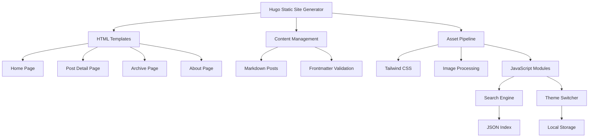

# デザイン文書

## 概要

「日々 (Hibi)」は、Hugoを使用したミニマリストなライフログブログです。提供されたデザインテンプレートを基に、検索機能とダークモード切り替え機能を備えた静的サイトを構築します。軽量性とパフォーマンスを重視し、HugoのImage Processing機能とTailwind CSSを活用します。

## アーキテクチャ

### システム構成



### ディレクトリ構造

```
hugo-blog/
├── archetypes/
│   └── default.md
├── assets/
│   ├── css/
│   │   └── main.css
│   └── js/
│       ├── search.js
│       └── theme.js
├── content/
│   ├── posts/
│   │   ├── 2026-01-12-mirai-hamburger/
│   │   │   ├── index.md
│   │   │   └── image.png
│   │   └── 2026-01-10-coffee-reading/
│   │       ├── index.md
│   │       ├── featured.jpg
│   │       └── gallery/
│   │           ├── photo1.jpg
│   │           └── photo2.jpg
│   └── about/
│       └── index.md
├── data/
├── layouts/
│   ├── _default/
│   │   ├── baseof.html
│   │   ├── list.html
│   │   └── single.html
│   ├── partials/
│   │   ├── head.html
│   │   ├── header.html
│   │   ├── footer.html
│   │   └── search.html
│   └── index.html
├── static/
│   └── favicon.ico
├── themes/
└── config.yaml
```

## コンポーネントとインターフェース

### 1. テンプレートシステム

#### Base Template (baseof.html)
- 全ページ共通のHTML構造
- Tailwind CSS読み込み
- ダークモード対応のクラス設定
- JavaScript モジュール読み込み

#### Header Component
- ロゴとナビゲーション
- 検索インターフェース
- テーマ切り替えボタン
- レスポンシブメニュー

#### Footer Component
- コピーライト情報
- ソーシャルリンク
- RSS フィード

### 2. 記事管理システム

#### Hugo Bundle構造
各記事はPage Bundleとして管理され、記事ファイル（index.md）と関連リソース（画像など）を同一ディレクトリに配置します。

```
posts/
├── 2026-01-12-mirai-hamburger/
│   ├── index.md          # 記事本文
│   ├── image.png         # featuredImage
│   └── thumbnail.jpg     # featuredImagePreview
└── 2026-01-10-coffee-reading/
    ├── index.md
    ├── featured.jpg
    └── gallery/
        ├── photo1.jpg
        └── photo2.jpg
```

#### Frontmatter Schema
```yaml
title: "みらいと池袋でハンバーグ"
date: 2026-01-12T15:00:00+09:00
draft: false
summary: "うーん。"
tags: ["ハンバーグ"]
featuredImagePreview: "thumbnail.jpg"  # Bundle内の相対パス
featuredImage: "image.png"             # Bundle内の相対パス
```

#### Content Processing
- Page Bundleからの画像自動検出
- Bundle内画像の自動最適化（WebP変換）
- 相対パス参照の自動解決
- タグとカテゴリの自動生成

### 3. 検索システム

#### Search Index Generation
```javascript
// Hugo build時に生成されるJSONインデックス
{
  "posts": [
    {
      "title": "記事タイトル",
      "summary": "記事の要約",
      "content": "記事本文（抜粋）",
      "tags": ["タグ1", "タグ2"],
      "date": "2026-01-12",
      "url": "/posts/article-slug/"
    }
  ]
}
```

#### Search Interface
- リアルタイム検索
- 日本語・英語対応
- 検索結果のハイライト表示
- キーボードナビゲーション対応

### 4. テーマ切り替えシステム

#### Theme Management
```javascript
class ThemeManager {
  constructor() {
    this.theme = localStorage.getItem('theme') || 'light';
    this.init();
  }
  
  toggle() {
    this.theme = this.theme === 'light' ? 'dark' : 'light';
    this.apply();
    this.save();
  }
  
  apply() {
    document.documentElement.classList.toggle('dark', this.theme === 'dark');
  }
  
  save() {
    localStorage.setItem('theme', this.theme);
  }
}
```

## データモデル

### Post Model
```yaml
Post:
  title: string (required)
  date: datetime (required)
  draft: boolean (default: false)
  summary: string (optional)
  content: markdown (required)
  tags: array<string> (optional)
  featuredImagePreview: string (bundle相対パス, optional)
  featuredImage: string (bundle相対パス, optional)
  slug: string (auto-generated)
  url: string (auto-generated)
  bundle: PageBundle (Hugo Bundle構造)
  resources: array<Resource> (Bundle内のリソース)
```

### Tag Model
```yaml
Tag:
  name: string (required)
  slug: string (auto-generated)
  count: integer (auto-calculated)
  posts: array<Post> (auto-generated)
```

### Archive Model
```yaml
Archive:
  year: integer
  months: array<Month>
  
Month:
  name: string
  number: integer
  posts: array<Post>
  count: integer
```

## 正確性プロパティ

*プロパティとは、システムのすべての有効な実行において真であるべき特性や動作のことです。これらは人間が読める仕様と機械で検証可能な正確性保証の橋渡しとなります。*

### プロパティ1: フロントマター検証
*すべての*記事について、必須フィールド（title、date）が存在し、有効な形式であり、無効なフロントマターは適切にエラーとして検出されること
**検証対象: 要件 2.1, 2.2**

### プロパティ2: 日本語コンテンツ処理
*すべての*日本語を含むコンテンツ（タイトル、本文、タグ）について、正しく処理され、適切にエンコーディングされ、URLスラッグが生成されること
**検証対象: 要件 1.4, 2.4, 6.4**

### プロパティ3: 検索機能統合性
*すべての*公開記事について、検索インデックスに対応するエントリが存在し、タイトル・コンテンツ・タグ・サマリーでの検索が正しく動作すること
**検証対象: 要件 3.2, 3.3, 3.4**

### プロパティ4: テーマ状態永続化
*すべての*テーマ切り替え操作について、ローカルストレージに保存された設定が次回訪問時に正しく復元されること
**検証対象: 要件 4.3, 4.4**

### プロパティ5: レスポンシブレイアウト
*すべての*画面サイズ（モバイル、タブレット、デスクトップ）について、レイアウトが適切に調整され、タッチ操作が正しく動作すること
**検証対象: 要件 7.1, 7.3**

### プロパティ6: 画像最適化統合
*すべての*Bundle内の画像について、HugoのImage Processing機能により最適化され、WebPフォーマットで配信され、Bundle内の相対パス参照が正しく解決されること
**検証対象: 要件 8.3, 8.7**

### プロパティ7: タグシステム整合性
*すべての*タグについて、利用可能なタグがすべて表示され、表示される記事数が実際の公開記事数と一致し、タグフィルタリングが正しく動作すること
**検証対象: 要件 6.1, 6.2, 6.3**

### プロパティ8: アーカイブ時系列整合性
*すべての*アーカイブページについて、記事が正しい年月に分類され、日付順（新しい順）に並び、ページネーションが正しく動作すること
**検証対象: 要件 5.1, 5.4**

### プロパティ9: SEOメタデータ完全性
*すべての*ページについて、適切なメタタグが生成され、XMLサイトマップに含まれ、RSSフィードが正しい形式で生成されること
**検証対象: 要件 8.1, 8.2, 8.5**

### プロパティ10: 記事状態管理
*すべての*記事について、draft状態の記事は公開サイトに表示されず、公開記事のみが検索インデックスとアーカイブに含まれること
**検証対象: 要件 2.3**

## エラーハンドリング

### 1. ビルド時エラー
- 無効なフロントマターの検出と警告
- 存在しない画像ファイルの検出
- 重複するスラッグの検出

### 2. 実行時エラー
- 検索インデックス読み込み失敗時のフォールバック
- 画像読み込み失敗時のプレースホルダー表示
- ローカルストレージアクセス失敗時のデフォルト設定

### 3. ユーザビリティエラー
- 検索結果が0件の場合の適切なメッセージ表示
- ページが見つからない場合の404ページ
- JavaScript無効時の基本機能確保

## テスト戦略

### 単体テスト
- フロントマター検証ロジック
- 検索機能のマッチングアルゴリズム
- テーマ切り替えの状態管理
- 画像最適化の設定

### プロパティベーステスト
- 各正確性プロパティに対応するテスト
- ランダムなコンテンツでの動作検証
- 最低100回の反復実行
- 各テストは対応するデザインプロパティを参照

### 統合テスト
- Hugo ビルドプロセス全体
- 検索インデックス生成と検索機能
- テーマ切り替えとページ表示
- レスポンシブデザインの動作確認

### パフォーマンステスト
- ページ読み込み速度
- 画像最適化効果
- 検索レスポンス時間
- モバイルでの動作確認