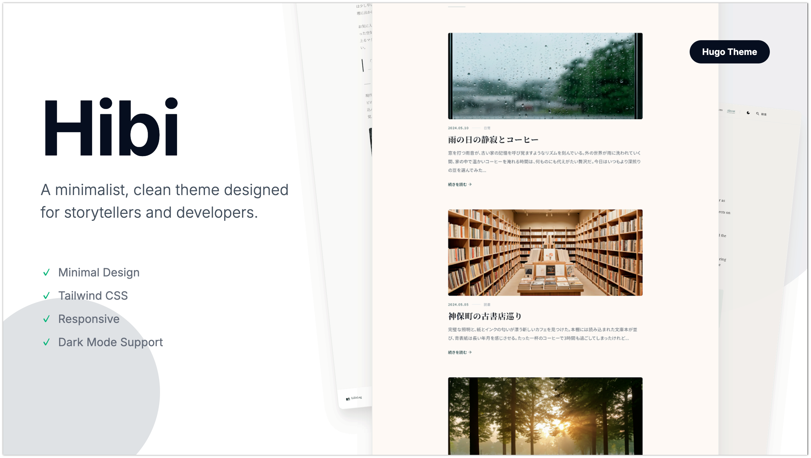

# hugo-theme-hibi

シンプルで静かな雰囲気のHugoテーマです。Tailwind CSS（PostCSS経由）でスタイルを生成しています。



## セットアップ

### 1) 前提条件

- Hugo Extended 版
- Node.js（npm）

※ CSSは `resources.Get "css/main.css" | css.PostCSS` を使うため、Hugo Extended と PostCSS が必要です。

### 2) テーマの導入（Hugo Modules）

`config.yaml`（または `config.toml`）にモジュールとして追加します。

```yaml
module:
  imports:
    - path: <module-path>
```

### 3) 依存パッケージのインストール

テーマリポジトリ直下で実行します。

```bash
npm install
```

npm init -y

npm i -D postcss postcss-cli autoprefixer

### 4) 開発サーバー起動

```bash
hugo server -D
```

## 使い方

### コンテンツ構成

- 記事: `content/posts/<slug>/index.md`
- 記事内の画像: 同ディレクトリに配置（Page Bundle）

### フロントマター例

```yaml
---
title: "タイトル"
date: 2026-01-21
subtitle: "サブタイトル（任意）"
tags: ["日常", "写真"]
featuredImage: "featured.jpg"
featuredImagePreview: "featured.jpg"
---
```

- `featuredImagePreview` があれば優先して使用します。
- `featuredImage` は記事詳細のヒーロー画像にも使われます。

### ホームの表示文言

`content/_index.md` のパラメータでトップページ文言を変更できます。

```yaml
---
homeTitle: "日々"
homeSubtitle: "静かな時間。"
homeDescription: "何気ない日常の瞬間を、言葉と写真で綴る。"
homeDescriptionSub: "ここは、心の澱を静めるための場所。"
---
```

### 主要設定（config.yaml）

`params` で主な挙動を調整します。

```yaml
params:
  tagFallbackLabel: 日常
  images:
    card: "640x webp q80"
    cardCompact: "300x webp q80"
    home: "800x webp q80"
    single: "1280x webp q85"
    ogp: "1200x630 center"
```

## ライセンス

未記載（必要に応じて追加してください）。
